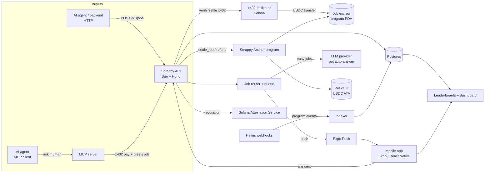
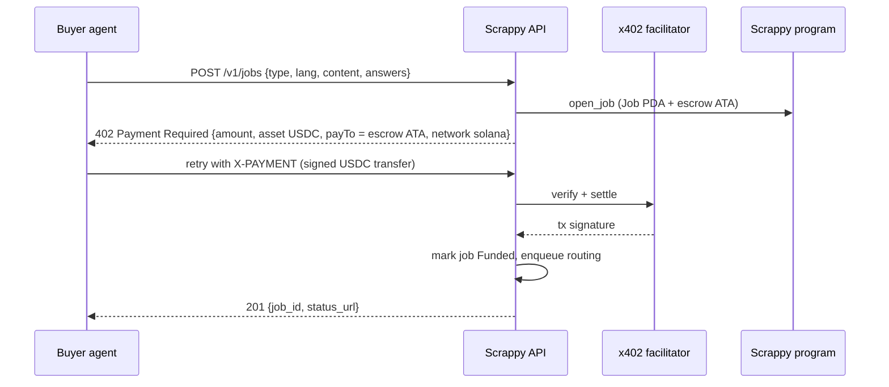
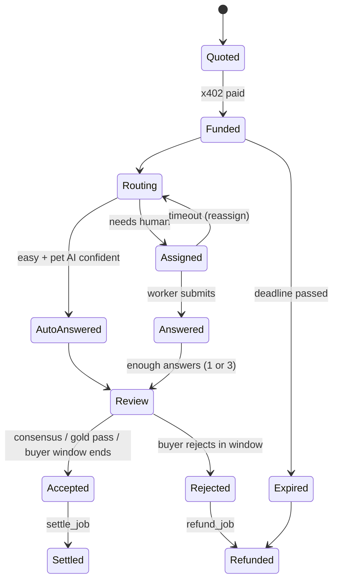

# Scrappy: Architecture

Companion to `PRD.md`. Stack rules: TypeScript everywhere offchain, Bun runtime, Anchor (Rust) onchain.
Items marked **[verify]** are library/API details to confirm on day 1 before building on them.

---

## 1. System overview



Principle: **money and final state onchain, fast game state offchain.** Balances, escrow, payouts, deaths, reputation snapshots and season results are onchain and verifiable. Hunger ticks, animations, the job queue and routing live in Postgres for speed.

## 2. Repo layout (Bun workspaces monorepo)

```
scrappy/
├─ programs/scrappy/          # Anchor program (Rust)
├─ apps/
│  ├─ mobile/                 # Expo React Native app (Android)
│  ├─ api/                    # Bun + Hono API, x402 seller, router, settlement worker
│  ├─ mcp/                    # MCP server exposing ask_human (x402 buyer side)
│  ├─ indexer/                # Helius webhook receiver -> Postgres
│  └─ web/                    # Public dashboard + share-card image endpoint + claim/landing
├─ packages/
│  ├─ sdk/                    # Typed client for API + program (used by mobile, mcp, web)
│  ├─ shared/                 # zod schemas: Job, Pet, Answer, events
│  └─ idl/                    # Generated Anchor IDL + TS types
└─ tests/                     # LiteSVM program tests, API integration tests
```

## 3. Onchain program (`scrappy`)

### Accounts
| Account | Seeds | Fields |
|---|---|---|
| `Config` | `["config"]` | admin, settler (API hot key), treasury, usdc_mint, fee_bps (1000), season, paused |
| `Pet` | `["pet", owner]` | owner, name_hash, trade (u8 lang, u8 task), born_at, status (Alive/Dead), jobs_done, earned_total, earned_outside, reputation_bps, last_fed_at, died_at |
| Pet vault | ATA of USDC owned by `Pet` PDA | pet's USDC balance |
| `Job` | `["job", job_id]` | buyer, price, fee_bps, required_answers, status (Funded/Settled/Refunded/Expired), deadline, result_hash |
| Job escrow | ATA of USDC owned by `Job` PDA | funds paid by the buyer via x402 |
| `Season` | `["season", n]` | start, end, merkle_root, reward_pool |
| `SeasonClaim` | `["claim", season, pet]` | claimed flag |

### Instructions
| Instruction | Signer | Effect |
|---|---|---|
| `init_config` | admin | set fee, settler, mint |
| `hatch_pet(name_hash, trade)` | owner | create `Pet` + vault |
| `open_job(job_id, price, required_answers, deadline)` | settler | create `Job` + escrow ATA (buyer funds land here through x402) |
| `settle_job(job_id, payees[pet, share_bps], inference_cost)` | settler | pay pets pro rata (minus inference cost), fee to treasury, emit `JobSettled` |
| `refund_job(job_id)` | settler | return escrow to buyer on reject/expiry, emit `JobRefunded` |
| `feed(amount)` | owner | owner tops up pet vault (optional; does not count as earnings) |
| `withdraw(amount)` | owner | move USDC from pet vault to owner wallet |
| `mark_dead(pet)` | settler | set Dead after starvation rule; vault stays withdrawable by owner |
| `publish_season(n, merkle_root)` | admin | store leaderboard root |
| `claim_season(n, proof, amount)` | owner | claim reward against root |

Events: `PetHatched`, `JobOpened`, `JobSettled{job, pets[], amounts[], outside: bool}`, `JobRefunded`, `PetDied`, `SeasonPublished`, `Claimed`.

`outside` is set by the settler when the buyer wallet is not linked to any worker (see anti-sybil). Leaderboards read `earned_outside` only.

Hackathon trust model: the settler key (API) decides acceptance and payees. It is a single hot key with narrow powers (can only move escrow to pets/treasury/buyer). After the hackathon: 3-worker consensus proofs + buyer co-sign for settlement.

## 4. Payments: x402 flow



- Seller middleware: x402 server package with Solana (SVM) support **[verify package + facilitator: Coinbase x402 SVM support or PayAI facilitator]**.
- If the facilitator cannot pay into a PDA-owned ATA, fall back: payTo = treasury ATA, then the settler moves funds into the job escrow in the same worker cycle.
- Price = task base price x required_answers + 10% fee, quoted in USDC (6 decimals).

## 5. MCP server (`ask_human`)

Tool definition exposed to any MCP client:

```ts
ask_human({
  task: "rate" | "verify_correct" | "record_audio",
  language: "hi" | "ta" | "mr" | "bn" | "te" | "kn" | "gu" | "en-IN",
  instructions: string,
  items: Array<{ id: string; content: string; options?: string[] }>,
  answers_per_item?: 1 | 3,       // default 3 for review tasks
  max_price_usdc: number,         // agent-side spend cap
  wait?: "none" | "until_done"    // until_done polls with timeout
}) => { job_id, status, results?: Array<{ id, answer, confidence }> }
```

The MCP server holds a buyer-provided Solana keypair (or delegate with an SPL allowance) and pays the 402 challenge automatically within `max_price_usdc`.

## 6. Job lifecycle



### Router rules
1. Filter pets: alive, language match, trade match, not already on this item.
2. Score: `reputation * 0.6 + freshness * 0.2 + fairness * 0.2` (fairness = fewer jobs today scores higher).
3. Push to top N candidates; first valid answer wins the slot; others get the next item.
4. Easy jobs (classifier + confidence ≥ 0.9): pet auto-answers via LLM, inference cost is recorded and deducted at settlement.

### Quality control
- Gold questions with known answers: 10% of a new worker's first 50 jobs, then 3%.
- 3-answer consensus for review tasks; minority answers do not get paid when consensus ≥ 2/3.
- Reputation = EWMA of gold accuracy and consensus agreement, stored in DB, snapshotted into `Pet.reputation_bps` at settlement and issued as an SAS attestation daily (SHOULD).

## 7. Pet game state (offchain, deterministic)

```
food = clamp(food - hours_since_last_tick * 4, 0, 100)
on job accepted: food = min(100, food + 15)
mood = f(food, earnings_today, streak)
status: food < 40 hungry · < 10 starving (push) · 0 for 72h -> mark_dead
```

Tick runs in the API worker every 15 minutes; `mark_dead` is the only game rule written onchain.

## 8. Data model (Postgres)

| Table | Key columns |
|---|---|
| `users` | id, wallet, auth_provider (google/seeker), city, college, referred_by, created_at, first_wallet (bool: new to Solana) |
| `pets` | id, owner_id, pet_pda, name, trade_lang, trade_task, food, mood, status, born_at, died_at |
| `buyers` | id, wallet, name, webhook_url, api_key_hash, linked_to_user (bool) |
| `jobs` | id, buyer_id, job_pda, type, lang, price, required_answers, status, deadline, funded_sig, settled_sig |
| `items` | id, job_id, content, options, gold_answer (nullable) |
| `answers` | id, item_id, pet_id, answer, audio_url, is_auto, latency_ms, correct (nullable), paid_amount |
| `reputation` | pet_id, score, gold_seen, gold_correct, consensus_agree |
| `events` | sig, type, payload (from indexer) |
| `seasons` | n, start, end, merkle_root, published_sig |
| `referrals` | inviter_pet, invitee_pet, bonus_paid |

## 9. API (Bun + Hono)

| Method | Path | Auth | Notes |
|---|---|---|---|
| POST | `/v1/jobs` | x402 | create + pay job |
| GET | `/v1/jobs/:id` | buyer key | status + results |
| POST | `/v1/jobs/:id/reject` | buyer key | within review window |
| GET | `/v1/me/pet` | wallet session | pet state, balance, food |
| POST | `/v1/pets` | wallet session | after `hatch_pet` tx confirmed |
| GET | `/v1/tasks/next` | wallet session | next assigned item |
| POST | `/v1/tasks/:itemId/answer` | wallet session | submit answer (audio via signed upload URL) |
| GET | `/v1/leaderboards/:board` | public | `?city=&college=&season=` |
| GET | `/v1/share/:petId.png` | public | share-card image |
| GET | `/v1/stats` | public | dashboard metrics |

Wallet session = Sign In With Solana message signed by the embedded wallet or MWA, exchanged for a short-lived JWT.

## 10a. DECISION (2026-09-24): web first, one codebase

`apps/web` (Next.js 16, React 19, Tailwind 4, Bun) is THE product: a responsive site for desktop and mobile browsers, installable as a PWA. The Android/Seeker app for CLOCK IN is the same site wrapped as a **Trusted Web Activity** (Bubblewrap), the route Solana Mobile supports for publishing PWAs to the dApp Store **[verify current dApp Store PWA/TWA guide]**.

| Concern | Web-first choice |
|---|---|
| Wallets on desktop | Solana wallet-standard adapters (Phantom, Solflare, Backpack) |
| Wallets on Android/Seeker | Mobile Wallet Adapter from the browser/TWA (`@solana-mobile/wallet-standard-mobile`) with Seed Vault **[verify]** |
| Non-crypto users | Embedded wallet with Google login (Privy or Phantom embedded, web SDK) **[verify]** |
| Push | Web Push via service worker (works in TWA/Chrome Android) |
| Audio jobs | MediaRecorder API |
| Offline | Service worker + IndexedDB queue for answers |
| APK | Bubblewrap TWA, `assetlinks.json` served from the site |

Section 10 below (Expo) is superseded; keep it only as a fallback if TWA blocks MWA or push.

## 10. Mobile app (Expo, Android) [SUPERSEDED by 10a]

| Concern | Choice |
|---|---|
| Framework | Expo (React Native), Solana Mobile Expo template **[verify template name]** |
| Seeker wallet | `@solana-mobile/mobile-wallet-adapter-protocol` + Seed Vault via MWA |
| Non-Seeker wallet | Embedded wallet with Google login (Privy Expo SDK or Phantom embedded) **[verify Solana support in Expo]** |
| Solana client | `@solana/kit` + generated Anchor client from `packages/idl` |
| Push | Expo Notifications (FCM) |
| Audio | expo-audio recording, upload to signed URL |
| Animation | Rive or Lottie pet rig (commissioned art, not generic AI style) |
| State | TanStack Query + Zustand |
| Offline | queued answers in SQLite, sync on reconnect |

Screens: Hatch · Home (pet, food, balance, rank chip) · Job card · Earnings feed · Leaderboards · Graveyard · Profile/withdraw · Invite.

## 11. Indexer and leaderboards

- Helius webhook on program ID, then `apps/indexer` parses Anchor events into `events` + updates aggregates.
- Boards are SQL views over settled outside earnings, filtered by season/city/college.
- Season end: build Merkle tree (pet, reward) from the final board, then `publish_season`; the app lets winners `claim_season`.
- Anyone can recompute boards from chain events: the "provably fair" claim.

## 12. Anti-sybil and fraud

| Threat | Control |
|---|---|
| Owner pays own pet to top boards | `outside` flag false if the buyer wallet is linked to any user or funded from a user wallet within 2 hops (Helius transfer lookups) |
| Multi-accounting workers | Ranked slot requires Seeker Genesis Token or SKR stake; Android Play Integrity check **[verify]**; payout hold 48h for accounts < 7 days old |
| Bot answers | gold questions, latency floor per task type, audio liveness (random phrase) |
| Settler key compromise | settler can only pay escrow to pets/treasury/buyer; per-job cap; key in KMS; `paused` switch |

## 13. SKR integration (SHOULD)
- Food and cosmetics purchasable with SKR (SPL transfer to treasury).
- Stake SKR (program vault) to unlock ranked mode on non-Seeker Android and a second trade slot; unstake after the season ends.
- Graveyard pool: a small % of platform fees in SKR distributed to stakers per season.

## 14. Security checklist
- Anchor constraints on every account (has_one owner/settler, seeds, mint checks); no `init_if_needed` on value accounts
- Checked math, u64 USDC amounts, fee bps bounds
- Settle payees must be `Alive` pets that answered the job (verified against an answers hash committed at settlement)
- Rate limits on API; zod validation on all inputs; job content PII filter
- LiteSVM tests: escrow happy path, refund, double-settle, wrong mint, wrong signer, dead pet payee

## 15. Environments and config

```
SOLANA_CLUSTER=devnet|mainnet-beta
HELIUS_API_KEY=...
USDC_MINT=...
SCRAPPY_PROGRAM_ID=...
SETTLER_KEYPAIR=kms://...
X402_FACILITATOR_URL=...
DATABASE_URL=postgres://...
LLM_API_KEY=...
EXPO_PUSH_ACCESS_TOKEN=...
```

Deploy: program via Anchor to devnet (Sep 30) then mainnet (Oct 3) · API/MCP/indexer on a Bun host (Fly.io/Railway) · Postgres on Neon · web on Vercel · APK via EAS build.

## 16. Build order (maps to PRD milestones)
1. Program: `hatch_pet`, `open_job`, `settle_job`, `refund_job` + LiteSVM tests
2. API: x402 `POST /v1/jobs` on devnet end to end with a script buyer
3. MCP `ask_human` paying the 402 automatically
4. Mobile: onboarding, pet home, job card, answer submit
5. Router + gold questions + consensus + settlement worker
6. Mainnet + first real buyer
7. Indexer, leaderboards, share cards, referral, dashboard
8. SKR + SAS + seasons (if time)
