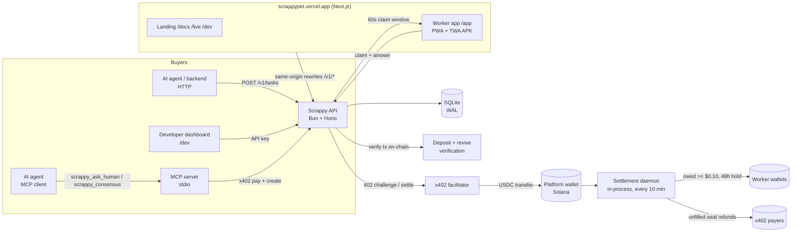

# Scrappy: Architecture

Companion to `PRD.md`. This document describes the system **as shipped**, not the original plan.
Stack: Bun + TypeScript everywhere, Hono API, SQLite, Next.js web app (also the Android app via TWA),
x402 v2 for buyer payments, real USDC transfers for payouts, refunds, deposits and revives.

The onchain escrow program (`programs/scrappy/`) is **not built**. Custody is a platform wallet:
buyers pay the platform address via x402, workers and payers are paid out of it by the settlement
daemon. Every transfer is a real Solana transaction recorded in `payments`.

---

## 1. System overview



Money path: agent USDC in (x402 or prepaid balance) -> workers paid 80% of each seat ->
unfilled seats refunded to the payer. Pet revives and worker-internal payments are
recorded in `payments` like every other transfer.

## 2. Repo layout

```
solana_coloseum/
├─ apps/
│  ├─ api/                    # Bun + Hono API: tasks, consensus, router, auth, payments, settlement
│  │   ├─ src/app.ts          # all HTTP routes
│  │   ├─ src/tasks.ts        # task lifecycle, consensus, router, levels, pet mechanics
│  │   ├─ src/db.ts           # SQLite schema + migrations
│  │   ├─ src/auth.ts         # worker Ed25519 sign-in, project API keys, rate limits
│  │   ├─ src/payments.ts     # deposit/revive tx verification, signed webhooks, web push
│  │   ├─ src/settle.ts       # claim-first settlement (payouts + refunds)
│  │   └─ src/index.ts        # wiring: paywall, sweeps, settlement interval
│  │   └─ scripts/            # deploy-guard.ts (agent demo), payout.ts, keys.ts, seed-gold.ts
│  ├─ web/                    # Next.js 16 app: landing, /docs, /dev, /live, worker app /app, PWA
│  ├─ android/                # Bubblewrap TWA project -> scrappy.apk (wraps the web app)
│  └─ mcp/                    # MCP server: scrappy_ask_human, scrappy_consensus, scrappy_find_capacity
├─ packages/sdk/              # @scrappy/sdk: Scrappy class (askHuman, consensus w/ escalation), verifyWebhook
└─ deploy/                    # git-archive deploy to VPS: systemd + Caddy, sslip.io upstream
```

Empty/on-deck: `programs/scrappy/` (escrow program), `apps/indexer/`, `packages/idl/`.

## 3. Deployment

| Piece | Runs on | Address |
|---|---|---|
| Web app | Vercel project `scrappy` | `https://scrappypet.vercel.app` |
| API | VPS, systemd `scrappy-api`, Caddy port 8795 | `https://187.127.137.136.sslip.io` (internal upstream) |
| API via web | Vercel rewrites `/v1/*`, `/health` | same-origin from the public domain |
| Android | Bubblewrap TWA, packageId `app.scrappypet` | `scrappypet.vercel.app/scrappy.apk` |

Workers and agents only ever see `scrappypet.vercel.app`. `vercel.json` proxies
`/v1/*` and `/health` to the VPS; CORS also allows direct calls.

## 4. Data model (SQLite, `apps/api/src/db.ts`)

Money is integer micro-USDC (`1 USDC = 1_000_000`). WAL mode, foreign keys on, single writer.

- `organizations` / `projects` / `api_keys` — developer accounts; `balance_micro` prepaid credit, `funding_wallet` for deposit verification, `webhook_secret`.
- `workers` — wallet, device `token_hash`, languages, reputation counters, `owed_micro` (unsettled earnings), `pending_micro` (claimed-but-in-flight settlement), pet fields (`pet_food`, `pet_hunger`, `pet_hunger_at`, `pet_starving_at`, `pet_dead`), `push_subscription`.
- `worker_skills` + `reputation_events` — per-language-skill accuracy (Laplace-smoothed) from gold tasks and consensus agreement.
- `tasks` — prompt, schema, language/skill, `min_accuracy`, seats, `reward_micro` per seat, `budget_micro`, deadline, status, `payment_tx`, `refund_*`, gold flag. Chained rounds share `root_id`.
- `task_assignments` — claims: one per `(root_id, worker_id)`, 60s expiry.
- `task_responses` — answers: normalized value, confidence, weight, latency, `paid_micro`.
- `consensus_results` — final answer, agreement, confidence, tally, latency.
- `payments` — every money movement: `payout`, `refund`, `deposit`, `revive`. `tx_sig` unique (real signature or a `claim:`/`revive:` placeholder) — doubles as an idempotency + double-claim guard.
- `notifications`, `auth_nonces` — web push dedup, single-use sign-in nonces.

## 5. Task lifecycle

```
pending_payment --x402 settle--> matching --first claim--> collecting
matching/collecting --deadline or last seat--> completed | low_confidence | insufficient_capacity
pending_payment --2 min unpaid--> cancelled
```

- `POST /v1/tasks` and `/v1/consensus` validate with zod, then check **capacity before payment** (409 `insufficient_capacity` — no charge for work that cannot run).
- Billing: x402 402-challenge settled by the facilitator (`markFunded` restarts the deadline when money lands), or API-key prepaid balance, or `none` (gold/internal).
- Consensus (`computeConsensus`): answer = most votes, agreement = vote share, confidence = accuracy-weighted share × mean self-confidence. `low_confidence` below the buyer's `quality_threshold`.
- Escalation: `extends: <task_id>` creates a chained round that excludes every worker from the chain (`UNIQUE(root_id, worker_id)`) — this is how SDK `consensus()` reaches the threshold.
- `sweep()` finalizes expired tasks and unpaid stragglers; runs inside `nextFor` and on an interval.

## 6. Router (`nextFor`)

Pull-based: workers poll `/v1/worker/next`. Priority order:

1. An open unexpired claim for that worker.
2. Gold qualification tasks (first 5 tasks, when gold templates exist for the language).
3. Live tasks in the worker's languages where: one seat left per human, not already in the chain,
   `eligible()` passes (language, Laplace-smoothed skill ≥ `min_accuracy`, probation cap ≤0.8
   for unproven workers, level gates below), Lv20+ queues sort by reward.

Dead pets cannot claim (`403 pet_dead`).

## 7. Worker levels

`levelOf(tasks_done)` = `1 + floor(done / 5)`, cap 30.

| Level | Tasks | Unlock |
|---|---|---|
| Lv5 | 20 | Seats paying ≥ $0.25 (`HIGH_REWARD_MICRO`) |
| Lv10 | 45 | Expert tasks (`min_accuracy ≥ 0.95`) |
| Lv20 | 95 | First pick: queue sorts by pay, not urgency |

Level gates apply in both `eligible()` and the capacity pre-check, so buyers are never
quoted capacity that can't actually reach their seats.

## 8. Pet mechanics (PRD §7)

Server-owned, lazy-ticked on worker reads (`tickPet`):

- Hunger +10 per 8h **only while live tasks exist** ("hunger turns on when jobs are live"); pauses when the network is quiet.
- Each completed answer earns +1 meal (`FOOD_MAX` 10).
- `POST /v1/worker/feed` spends one meal, −40 hunger.
- Hunger 100 = starving; >72h starving = dead. Dead workers can't claim tasks.
- `POST /v1/worker/revive` costs $0.05: deducted from `owed_micro` when sufficient (recorded as a `revive` payment), otherwise the worker sends USDC to the platform wallet and `verifyRevive` confirms the transfer on-chain.

## 9. Money flows

| Flow | Path |
|---|---|
| Buyer pays | x402 → facilitator → platform wallet (`tasks.payment_tx`), or prepaid `balance_micro` |
| Worker earns | `reward_micro × 0.8` → `owed_micro` on response |
| Worker paid | Settlement daemon: claim `owed→pending` atomically (unique `claim:` tx_sig placeholder), transfer USDC, record `payout`, mark pending settled. Crash-safe, no double-pay across daemon/script/VPS timer. |
| Seat refunds | Unfilled seats → `refund_micro`; prepaid refunded internally, x402 refunded on-chain to `payer`. |
| Project deposits | `verifyDeposit`: confirmed tx moving USDC from `funding_wallet` → platform; credited once per sig. |
| Pet revive | `revive` payment: internal owed deduction or verified on-chain transfer. |
| Worker hold | First payout blocked for 48h after account creation. |

## 10. Auth & abuse controls

- Workers: wallet proves identity by signing `Scrappy sign-in` (Ed25519 over the wallet pubkey, 5-min single-use nonce) → device `sw_` token (sha256 stored).
- Developers: `scrappy_sk_` API keys (sha256 stored, revocable, per-key labels).
- Rate limits: token-bucket per IP per route group (signup 10/min, signin 20, poll 120, respond 60, deposits 20).
- Anti-farming: 2s answer latency floor; gold known-answer tasks gate skill claims; one seat per human per task; chain workers can't re-answer.
- Webhooks: SSRF guard (public https only), HMAC `x-scrappy-signature: t=...,v1=...`.

## 11. SDK & MCP

- `@scrappy/sdk` (`Scrappy` class): `askHuman`, `consensus` with automatic `extends` escalation until agreement/budget/deadline limits, `findCapacity`, `verifyWebhook`. Defaults to `https://scrappypet.vercel.app`.
- MCP server (stdio): `scrappy_ask_human`, `scrappy_consensus`, `scrappy_find_capacity` — pays x402 automatically from an agent wallet.

## 12. Testing

- `bun:test`, `:memory:` DB, injected fake paywall + scripted RPC — 26 tests cover consensus math, escalation chains, capacity gating, auth/replay, gold warmup, level gates, deposits, settlement claiming, and the full pet loop (feed/starve/die/revive).
- `setSystemTime` drives the clock for deadline/hunger assertions.
